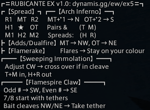
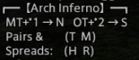
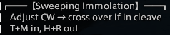

+++
title = "EX5: Rubicante"
weight = 5
+++
# EX5: Rubicante

*Contributors*:
B'uzhi Amaroh @ Maduin,
Yuno Kashiki @ Seraph,
Tvnariea Reksane @ Seraph,
Torenimo Mox @ Maduin.

## Macro v1.0



```
/p ═RUBICANTE EX v1.0: dynamis.gg/ew/ex5═
/p ┏【Spread】┓┏━【Arch Inferno】━┓
/p     R1   MT   R2      MT+*1 → N   OT+*2 → S
/p     H1   ★    H2      Pairs &        (T  M)
/p     M1  OT  M2      Spreads:    (H  R)
/p ┣【Adds/Dualfire】MT → NW, OT → NE
/p ┣【Flamerake】        Flares → Stay on your colour
/p ┏━━━【Sweeping Immolation】━━━┓
/p     →    ↑      ↑    ←    ※ Spread colour pairs
/p    MT  M1  M2  OT         T+M in, H+R out
/p    R1   H1   H2   R2   ※ Stack at M1
/p ┏━━━【Flamespire Claw】━━━┓
/p    Odd # → SW, Even # → SE
/p    7/8 start with tethers
/p    Bait cleaves NW/NE → Take tether
```

## Resources

The strats we follow are the same as the strat's in Hector's guide with three changes:

1. We place the #1 marker in the NE corner, per [DESU conventions](/conventions#markers).
2. We use standard clock spots rather than putting the OT east. The alternate arrangement is only used for the crossover Sweeping Immolation strat.
3. We use a fixed position system for Sweeping Immolation, as described by Hector at 14:38 in his video, rather than the crossover strat.

{{ youtube(id="1_v6v2nmVJ0" }}

These strats are also the same as used on [Elemental DC](https://tuufless.github.io/FFXIV-Elemental-Raid-Macros/6.0_endwalker/extreme_trials/rubicante/) with the exception of the Flamerake strat.

## Breakdown

### Spread


We use [standard spread positions](/etiquette#positions).

### Arch Inferno



For Arch Inferno, the main tank and melee/ranged/healer 1 all go north, and the off-tank and melee/ranged/healer 2 all go south (these are standard light parties).

The tanks and melee DPS stand in front of the healers and ranged DPS (that is, closer to the boss).
For pairs, the two melees pair together and the two ranged pair together.
For stacks, everyone spreads with the supports to the left of the DPS, relative to the boss.

### Adds/Dualfire


For the tethers in the adds phase and the Dualfire double cleave, the main tank takes the NW add/stands in the NW spot, while the OT takes the ET add/spot.

### Flamerake


During Flamerake, the mechanic can be resolved individually if everyone with flares stays within their colour marker. So, for instance, if the MT has a flare, they should take the flare in either the N (A marker) or NE (1 marker), whichever is safe.

### Sweeping Immolation



When Sweeping Immolation has a spread, everyone should take a fixed position relative to the boss to take the spread.
The melees will always be closer to the boss, with the main tank and ranged 1 on the boss's left side and the off-tank and ranged 2 on his right.

When there is a stack, gather behind and to the left of the boss, at the `M1` spread position.

We do not use the crossover strat.

### Flamespire Claw


For Flamespire Claw (sometimes called limit cut), players should gather SW (3 marker) if they have an odd (blue) indicator, SE (2 marker) if they have an even (red) indicator.

Cleaves will be baited toward the NW (4 marker) and NE (1 marker) corners.
The players with indicators 1 & 2 can head to their cleave markers as soon as the mechanic begins.

The players with indicators 7 & 8 should move in closer to the boss to take the first tethers.
After each cleave, the player who baited that cleave should come in and grab the tether from the player on the same side as them.
The player who previously had the tether can return to the rest of the group.


