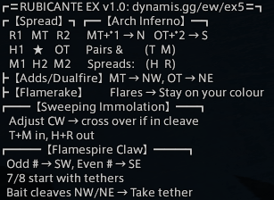
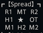
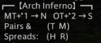
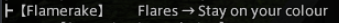
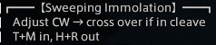
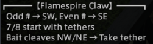

+++
title = "EX5: Rubicante"
weight = 5
+++
# EX5: Rubicante

[**Discuss on
Discord**](https://discord.com/channels/1037850893468569690/1049864902220730449)

*Contributors:
B'uzhi Amaroh@Maduin,
Space Invader@Seraph,
Yuno Kashiki@Seraph,
Torenimo Mox@Maduin,
Tvnariea Reksane@Seraph.*

## Macro v1.0



```
/p ┏═RUBICANTE EX v1.0: dynamis.gg/ew/ex5═┓
/p ┏【Spread】┓┏━【Arch Inferno】━┓
/p     R1   MT   R2      MT+*1 → N   OT+*2 → S
/p     H1   ★    OT      Pairs &        (T  M)
/p     M1  H2  M2      Spreads:    (H  R)
/p ┣【Adds/Dualfire】MT → NW, OT → NE
/p ┣【Flamerake】        Flares → Stay on colour
/p ┏━━【Sweeping Immolation】━━┓
/p     Adjust CW → cross over if in cleave
/p     T+M in, H+R out
/p ┏━━━【Flamespire Claw】━━━┓
/p    Odd # → SW, Even # → SE
/p    7/8 start with tethers
/p    Bait cleaves NW/NE → Take tether
```

## Resources

The strats we follow are the same as the strat's in Hector's guide (below).
The only difference from the video is that, per [conventions](/conventions#markers), the #1 marker should be in the NE corner, but none of the strats rely on the marker position so this is not super important.

{{ youtube(id="1_v6v2nmVJ0") }}

These strats are also the same as used on [Elemental DC](https://tuufless.github.io/FFXIV-Elemental-Raid-Macros/6.0_endwalker/extreme_trials/rubicante/) with the exception of the Flamerake and Sweeping Immolation strats.

## Breakdown

### Modified Spread



We use non-standard spread positions with the H2 and OT swapped from their usual spots.
This allows both tanks to get full uptime during Sweeping Immolation.
Even though the modified spread is for Sweeping Immolation specifically, it applies to all mechanics.

### Arch Inferno



For Arch Inferno, the main tank and melee/ranged/healer 1 all go north, and the off-tank and melee/ranged/healer 2 all go south (these are standard light parties).

The tanks and melee DPS stand in front of the healers and ranged DPS (that is, closer to the boss).
For pairs, the two melees pair together and the two ranged pair together.
For stacks, everyone spreads with the supports to the left of the DPS, relative to the boss.

### Adds/Dualfire


For the tethers in the adds phase and the Dualfire double cleave, the main tank takes the NW add/stands in the NW spot, while the off-tank takes the NE add/spot.

### Flamerake: Stay on Colour



During Flamerake, the mechanic can be resolved individually if everyone with flares stays within their colour marker.
So, for instance, if the MT has a flare, they should take the flare in either the N (A marker) or NE (1 marker), whichever is safe.
The stack is always taken in the center, and the spread afterwards should be from original spread spots.

### Sweeping Immolation: Crossover Strat



To resolve Sweeping Immolation, everyone begins at their clock spot for the initial spread and line AoEs.

Immediately afterwards, adjust CW halfway to the next waymark, out of the line AoEs.
Then check if you are going to be in the boss's cleave arc.
If so, cross to the safe slice directly opposite yours.

For spreads, melees and tanks take positions close to the boss, healers and ranged on the outside.
For stacks, converge on the inner safe slice nearest you, in melee range.

### Flamespire Claw



For Flamespire Claw (sometimes called limit cut), players should gather SW (3 marker) if they have an odd (blue) indicator, SE (2 marker) if they have an even (red) indicator.

Cleaves will be baited toward the NW (4 marker) and NE (1 marker) corners.
The players with indicators 1 & 2 can head to their cleave markers as soon as the mechanic begins.

The players with indicators 7 & 8 should move in closer to the boss to take the first tethers.
After each cleave, the player who baited that cleave should come in and grab the tether from the player on the same side as them.
The player who previously had the tether can return to the rest of the group.

## Variant Strats

**Important:** When using variant strats, please change the macro header to clearly indicate that you are using a variant, to prevent multiple versions of the official macro from proliferating.

### Sweeping Immolation: Boss-Relative Strat


```
/p ┏═RUBICANTE EX VARIANT: dynamis.gg/ew/ex5═┓
/p ┏━━【Sweeping Immolation】━━┓
/p     →    ↑     ↑    ←     ※ Spread colour pairs
/p    MT  M1  M2  OT         T+M in, H+R out
/p    R1   H1   H2  R2    ※ Stack at M1
```

This alternative strat sees players occupy positions fixed relative to the boss based on their position.
Note that the first row of the macro denotes the inner semicircle around the boss,
and the second row denotes the outer semicircle.

In addition to the crossover strat above, the boss-relative strat is popular on PF, particularly among experienced players.
DESU recommends the crossover strat, however, because it is quicker to learn and teach.

*Note:* This strat is often referred to on PF as the "static" strat.
This is a misnomer, as the positions are not at all static but actually relative to the boss.
So we call this the "boss-relative" strat instead.
